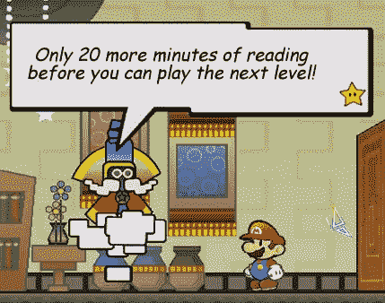

# 未来主义者:18 款 Wii 游戏的一句(或两句)评论

> 原文：<https://web.archive.org/web/http://techcrunch.com:80/2007/07/26/the-futurist-one-or-two-sentence-reviews-of-18-wii-games/>

我相信 Wii，真的。我不在乎它基本上是一个白色外壳和花哨控制器的 GameCube。我不在乎图形让最初的 Xbox 看起来像 l33t。我只是希望他们能推出一些像样的游戏。相信我，大部分我都玩过。这是我目前的想法。而且如果看完这个，好像每个游戏都有问题，那是因为每个游戏都有问题。

**塞尔达传说:暮光公主**我可能找到了一堆叫做伪造黑暗的东西的碎片，但是我很乐意用它来换回我生命中的最后 100 个小时，拜托了。

**超级纸马里奥**读，读，读，跳，读，读，读，翻，读，读，读，读，关机。

仅仅是我，还是这个游戏的一半是在 Windows 95 中用 Corel Paint 制作的？

创伤中心:第二意见无论我怎么努力，我都无法缝合伤口。

**雷曼语无伦次的兔子们:**在尝试关上同样的厕所门大约 4 个小时后，我放弃了。

**Wii Sports** 精简版棒球其实更让我向往*满垒。*

**Elebits** 玩了几把，这个游戏就在我抽屉里玩捉迷藏。

我绝对没有理由要握着我的手去扔手榴弹。

《教父:黑手版》他们试图将游戏融入电影中每一个标志性场景的努力简直荒谬得令人难以置信。说真的，为什么有人会在潜入一所房子的时候杀了 10 个人，只为了在床上留下一个马头？

虽然我一个字也听不懂这个游戏里的人在说什么，但是我可以通过随意的握手来赢得战斗。

对于一款迷你游戏来说，要找到这些迷你游戏实在是太难了。

恼人的种族刻板印象不会让游戏变坏，重复性运动障碍会。

烹饪妈妈:下厨这应该是*中的一个小游戏。结束了。*

**TMNT** 奔跑，跳跃，疯狂的甩动手臂，停止无聊的玩耍。

老实说，我不知道如何走出这个游戏中的第一个房间。说真的，我试了大约 30 分钟。考虑到我比目标观众大 15 岁左右，这是一个非常不好的迹象。

一个游戏怎么会毫无意义，却又简单得让人无法原谅？

**翼岛**不完全是*领航翼*。

**快乐大脚**这个游戏的一半感觉像是*跳舞革命*在控制面板上玩，另一半我懒得玩。

这就是了。点燃火焰。

Seth Porges 为他的专栏《未来主义者》撰写了关于未来技术及其在个人电子产品中的作用的文章。它每周四出版，过去专栏的档案可以在这里找到。