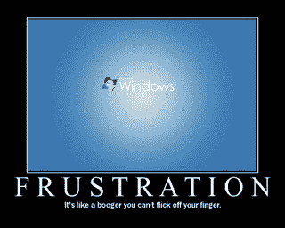

# 未来主义者:电子产品变得更好的简单方法

> 原文：<https://web.archive.org/web/http://techcrunch.com:80/2007/07/19/the-futurist-simple-ways-gadgets-could-be-better/>

我们喜欢小玩意。而且，就像我们喜欢的所有东西一样，小玩意让我们恼火。很多次，我拿着一个产品，心想:“这将是完美的，如果…

事实是，即使有无数代人和充满愤怒粉丝的网络论坛，公司仍然会重复无数的错误。这些错误就像打在各地辛勤工作的电子工程师脸上的一记耳光。在这一期的《未来学家》中，我列出了一些公司应该做的事情，让他们的产品——任何产品——变得更好。

**不需要安装软件**

我最近得到了一个柯达数码相框。当我打开它时，我发现它闪闪发光，很漂亮，并且装载了相当数量的板载内存。然后我找到了安装说明。第一步:在我的电脑上安装柯达的 sEasyShare 软件。好吧，我想。也许它需要我使用它的软件包来加载照片。大约浪费了 20 分钟(和几兆字节)后，我意识到我可以很容易地将相框插入电脑的 USB 驱动器，然后简单地将 JPEGs 文件拖放到设备上。事实上，经过大约 15 分钟的修修补补，我甚至无法找到一种方法来将附带的软件与框架连接起来。

公司注意:当你要求我们安装你的臃肿，系统缓慢的软件来加载一个小工具(Zune，有人吗？).当我们不需要安装它的时候，你却告诉我们需要安装，这就更让人恼火了。

让我们这么说吧:任何自由浮动的移动小工具都没有理由要求你使用 Windows。

**别这么激动**

我的 iPod 本质上是一台微型电脑。每天使用时间长达 10 小时。摸起来很凉。那么，为什么没有人能制造出一台笔记本电脑，即使有一对粉丝疯狂地为正义而战，也不会热到烧焦大腿的程度呢？

**不要装垃圾**

如果我花了几千美元买了一台笔记本电脑，我会觉得打开电脑，发现几十个垃圾软件程序在恳求我升级试用版，这有点侮辱人。一些系统的加载方式，你会认为他们是广告支持的。但笔记本电脑不是网络电视，即使你可以选择你想要多大的硬盘和你需要多少内存，在制造商网站上向你展示的过多的定制设置中，没有一个选项可以选择无软件的电脑(除非你选择 Mac，我想。)

在我看来，垃圾就是盗窃。是盗窃硬盘空间，是盗窃系统资源，是盗窃时间。

新规则:如果你在我的电脑上出现试用版，我将永远不会买你的完整版。永远不会。

**不要使用专有线缆**

我知道如果我丢失了连接线，你希望我支付 20 美元给你(而不是其他人)。我尊重这一点。不幸的是，从 3 英尺外看，所有的电线本质上都是一样的，我家就有很多这样的电线。把我房子里的所有电线连接起来，你或许可以在月亮上扔一个套索。友善点，走标准路线。

**不要使用翻译不当的说明书**

亚洲给我们带来了很多很多伟大的小玩意，每当我们在美国得到一个以前只有亚洲才有的设备，通常都是一种享受。不幸的是，一些公司仍然没有意识到让一个以英语为母语的人校对你的说明书是有帮助的。说真的，就雇一个西北大学的学生当实习生，用大学学分给他工资，确保你的论文有意义。求你了。

**不要试图把糟糕的功能说成是加分项**

有多少次你看到一家公司试图把它对 AA 电池的依赖说成是“对旅行者很好！”我更愿意随身携带一根充电线，而不是一堆 AAs 和一个电池充电器，我相信你也会这样做。

Seth Porges 为他的专栏《未来主义者》撰写了关于未来技术及其在个人电子产品中的作用的文章。它每周四出版，过去专栏的档案可以在这里找到。