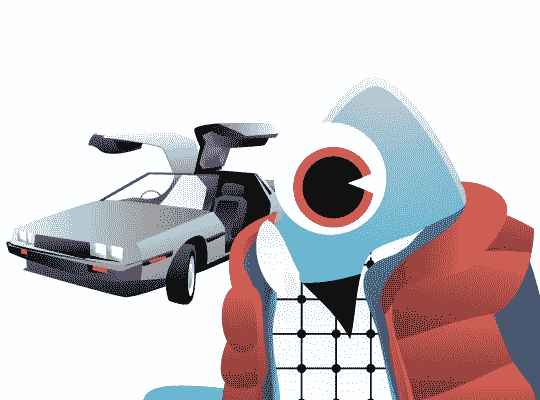

# 未来学家:一年中最美好的时光还是……2007 年 CES  一瞥

> 原文：<https://web.archive.org/web/http://techcrunch.com/2006/12/21/the-futurist-that-most-wonderful-time-of-the-year-or-a-first-look-at-the-2007-ces/>

在这一集非常特别的《未来学家》中，我们将目光短浅地展望未来。三周后，在一个叫做拉斯维加斯的地方，在一场名为 CES 的年度科技狂欢中，公关人员请男性杂志产品评论员跳大腿舞，巧克力喷泉的味道弥漫在每个走廊的空气中，没有一个博客写手不会因为无休止的会议而感到疼痛。

虽然意外不可避免地会出现，而且我倾向于在任何扔在我面前的 NDA 协议上签名，这使我无法透露我知道的一些事情，但我们仍然可以猜测即将发生的事情。

本周，我们来看看几个我们可以期待在下个月看到的东西。我已经抛出了几个可能会突然出现的值得注意的技术项目，但我主要关注的是有趣的小毛病和展示机制，这些都是值得关注的，因为 CES 正在走向不可避免的 E3 式的自我毁灭的命运。而且，在我的每一个预测都不可避免地被证明是错误的之后，你可以把这个专栏的打印件扔到我面前。

点击跳转观看水晶球，不要忘记在一月份回来查看 CrunchGear 对 CES 的全天候报道…

**Wii 的吉他英雄**
想象一个专为 Wii 制作的无线吉他英雄控制器，它可以跟踪你的动作，并让你的小摇滚神化身模仿它们。那将会是有史以来最伟大的比赛。而且不要以为它没有闪过那些疯狂的任天堂游戏奇才的脑海…

搭建一个 CES 展台可不便宜。CEA 不仅收取 PS3 级别的楼面面积费用，而且许多这些大型建筑实际上是多房间、多层建筑，在拆除成垃圾填埋场之前可以站立一周(我去年最喜欢的是 iRiver ' s——他们制作了一个微型夜总会式的小屋，配有豪华沙发、DJ，当然还有展台宝贝。)对于一些公司来说，这种投资可能看起来不太值得，而且长途跋涉到你在凯撒酒店的套房参加私人会议也是注定要失败的。这就是为什么我们可以期待看到许多讨厌的公关人员用他们的雷达寻找带着名牌的记者(国家电视台、大型 circ 杂志和顶级报纸可以期待最受追逐)，因为他们试图在不支付租金的情况下推销他们的产品。

移动电视
目前的海滨电视节目很少，远远达不到韩国的质量。显然，关键是获得我们想看的电视台的直播，而不是粗制滥造的 mobi-sodes，其中有《T3》、《办公室》(我喜欢的节目)或我最喜欢的《T5》夏威夷热带比基尼大赛 (Sprint 以每月 6.99 美元左右的价格出售这种最软的软核色情短片。谢谢冲刺！)今年的领导者将是 MediaFlo，但也请关注 HTC 合作的 Modeo 和他们的 Foreseer 手机。几乎可以肯定的是，我们的 CDMAers Sprint 和威瑞森将在这一领域抢占先机。Cingular 可能会紧随其后，预算和党的头脑 T-Mobile 排在最后。小心这四家公司，以及 MVNOs，将 2007 年吹捧为移动视频年，然后在明年没有人使用它的时候重复这一声明。此外，请注意黑马 Sling Media，其 Sling 移动应用程序(在去年的大会上首次亮相)很可能会在达到临界质量之前给这个行业的巨人泼冷水。

传统上，主厅被一些巨大的“摊位”占据(这个词有点用词不当，因为其中一些有仓库那么大)，但预计新一波无名小卒会试图通过在索尼和三星旁边的体面空间开店来窃取一些声望。去年，韩国巨头克比拿出了一些主要的正厅房地产松下一箭之遥。预计 Vizio、Sceptre 和我没有听说过的其他公司这次也会尝试同样的做法，从而破坏他们全年的营销预算。这是他们展示自己能与大人物一起奔跑的机会，没有什么比在南大厅(或者，上帝保佑，金沙)开店更能代表“B-list”，在这里，iPod 配件和印度微处理器公司有宾至如归的感觉。

**派对**
在会议中心穿梭只是一个好的 CES 与会者工作的一部分。同样重要的是聚会——对于记者来说，这是融合与公关人员之间的信任纽带，从而带来 NDA 和拥抱的必要条件。如果你在镇上，尽你最大的努力登上摩托罗拉(去年的 motoPRTY 以喷火战机乐队为特色)、Monster Cable(斯蒂维·旺德)和 Kodak(一个道德上有问题的礼品袋)的名单。

PlayStation 3 纪念奖(PlayStation 3 Memorial Award)
很难说谁会是我们年度大奖的第一个获得者，这个奖项颁发给了在商店货架上出现之前进行了最多贸易展览的产品，但明智的选择是 SED 电视(平心而论，他们从未声称在 2007 年底之前提供这些产品)。把你的提名和任何其他 CES 的预测放在“评论”栏里。

Seth Porges 为他的专栏《未来主义者》撰写了关于未来技术及其在个人电子产品中的作用的文章。它每周四出版，过去专栏的档案可以在这里找到。