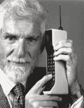

# 未来主义者:即将到来的手机设计解放

> 原文：<https://web.archive.org/web/http://techcrunch.com/2007/05/24/the-futurist-the-impending-liberation-of-mobile-phone-designs/>

手机的外形很大程度上是因为该设备首先需要像手机一样工作。也就是说，它必须贴着你的脸。

当然，这种情况正在改变。在过去的几年里，蓝牙耳机已经从中层管理者普及到了夜总会。几年后，直接对着手机说话的想法将会像转盘一样过时。这并不是说手机设备会完全取消内置麦克风和扬声器(至少在我有生之年不会)，但它们最终只会成为你的耳机放进洗衣机时的备用设备。

关键是:一旦与手机交互的主要方式从内置扬声器转向其他方式(蓝牙或其他)，设计师将从典型的手机设计中解放出来，并最终有自由打破陈旧的糖果条、蛤壳和滑块的模式。

就技术限制而言，我们已经基本上达到了可以将电话听筒装进一个难以置信的小而薄的包里的程度。最薄的竞赛已经基本结束了(坐下来，在你的后口袋里放上任何比[三星痕迹](https://web.archive.org/web/20170707160613/http://crunchgear.com/2006/10/24/samsung-gets-thinner-than-trace/)更薄的东西，你很可能会听到“啪”的一声)。真正让手机保持长而宽的唯一原因是对舒适性和人体工程学的关注——仅仅是将手机拿在手中贴着脸的必要性的副产品。取消这一标准，一大堆外形就成了选项。

想象一下，一部卡片形状的手机不比一张 Visa 卡大，可以很容易地放进你的钱包。对于女士来说，一个漂亮的新手环手机(或者任何一件珠宝)怎么样？未来在于设计不会妨碍你的外形，不会让你感到沉重，也不会让你觉得你在携带超出自己体重的东西——也就是所谓的“可穿戴”设备。iPhone 等手机已经将手机上的物理按键数量削减到了最低限度。根据情况变化的“虚拟”键和超薄有机发光二极管或电子墨水式显示器的组合可以创建一种需要绝对最小显示空间的功能设备。

消费者已经厌倦了老一套的设计(手机制造商请注意:你不断推出相同的外形是手机在非技术导向的消费者生活方式杂志中覆盖率下降的直接原因——编辑和艺术部门只是厌倦了看到相同的矩形框)，我假设产品设计师渴望有机会将他们的概念草图变为现实。希望很快，他们就有机会。

塞斯·波吉斯为他的专栏《未来学家》撰写了关于未来技术及其在个人电子产品中的作用的文章。它每周四出版，过去专栏的档案可以在这里找到[。](https://web.archive.org/web/20170707160613/http://www.crunchgear.com/category/the%20futurist)