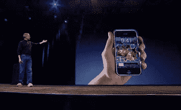

# 未来学家:为什么 iPhone 散发着计划淘汰的味道

> 原文：<https://web.archive.org/web/http://techcrunch.com/2007/06/14/the-futurist-why-the-iphone-reeks-of-planned-obsolescence/>

# 未来学家:为什么 iPhone 散发着计划淘汰的味道

关于上周反苹果界的[漩涡，我对 iPhone 的看法没有改变:这款设备最终会非常棒，但现在为它支付 600 美元(如果考虑到你将签署的两年期合同的价值，实际成本接近一千美元，事实上许多早期用户也可能面临终止 T-Mobile 或 Sprint 交易的账单)是愚蠢的。这不仅仅是因为潜在的漏洞(很明显，这只是我的猜测)，而是因为苹果似乎准备好让 iPhone 成为计划淘汰的一员。](https://web.archive.org/web/20220706132247/http://crunchgear.com/2007/06/07/the-futurist-we-predict-the-iphone-will-bomb/)

请继续阅读，了解原因。

众所周知，第一代 iPhone 将缺乏功能:它缺乏 GPS、3G 网络支持、原生 IM 支持、彩信和企业电子邮件支持，这只是其中几个比较明显的遗漏。所有这一切令人沮丧的不仅仅是缺乏基本的功能，而是对苹果来说包含这些东西是多么容易。毕竟，我们谈论的是免费合约手机多年来的标准配置(我在 2001 年的时候就在用手机聊天)，苹果基本上不需要为此付出任何代价。

此外，几乎每一个缺失的功能都可以以一种非常特殊和重要的方式改善 iPhone 要么通过以更有用的方式补充现有的功能，要么因为这些功能是我们对一部标榜自己功能丰富、以娱乐为中心、有趣的*手机的期望。*

拿丢失的 GPS 来说。出厂内置的谷歌地图是 iPhone 的一个主要卖点(它出现在广告中！).然而，它的功能落后于其他手机，如黑莓 8800，后者成功地将其与 GPS 接收器融合在一起。如果有人还没有探索这个非常酷的应用程序，把它从盒子里拿出来交给他们可能听起来不错——直到你给他们看另一部手机，程序会立即锁定你的位置。

以缺乏即时消息和企业电子邮件支持为例。这实际上把 iPhone 卡在了黑莓和 Sidekick 之间的这个奇怪的中间地带——也就是说，它对商人和他们沉迷于 IM 的孩子都同样没有用。当然，必须指出的是，考虑到人们打字的机会如此之少，缺少真正的键盘将会少很多麻烦。

真正让我恼火的不仅是这些功能显然都在苹果的能力范围之内，或者它们是人们实际上会使用的功能，而且苹果无疑知道所有这些功能，并且很有可能正在计划在不久的将来推出装载部分或全部这些功能的手机——这一举动将使第一代 iPhones 的所有者看起来像是过时技术的持有者。这几乎让人觉得这些功能是有意识地从第一代 iPhone 中剥离出来的，没有别的原因，只是因为它们可以。换句话说:它指出了一个非常明显的未来计划淘汰的例子。

众所周知，苹果公司淡化了现有产品线中没有的任何功能的重要性。以移动视频为例——直到 5G iPod 发布之前，史蒂夫·乔布斯发表了无数次公开声明，称没有人有必要在小屏幕上观看视频。苹果可能会声称，他们只为 iPhone 包装了客户想要的功能，但这并不意味着他们没有有意识地策划如何将一款尚未推出的产品变成一款过时的产品。

塞斯·波吉斯为他的专栏《未来学家》撰写了关于未来技术及其在个人电子产品中的作用的文章。它每周四出版，过去专栏的档案可以在这里找到[。](https://web.archive.org/web/20220706132247/http://www.crunchgear.com/category/the%20futurist)