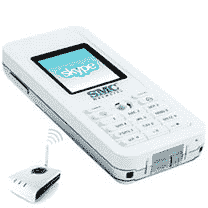

# 2007 年 Skype 大赛第二天

> 原文：<https://web.archive.org/web/http://techcrunch.com/2007/04/10/the-great-skype-contest-of-2007-day-2/>

好了，朋友们，从美国东部时间上午 9 点起，我们不再接受“SkypeMe”主题行。现在你必须搜索我们的帖子，寻找下一个秘密主题。昨天的获奖者是 Dan K .概括一下，他将获得:

赠送给我们读者的五部 SMC WiFi 手机和 FON 路由器套件之一。
在盒子里你会发现:

*   用于 Skype WSKP10 的 WiFi 电话*   FON 路由器*   500 SkypeOut 分钟*   12 个月 Skype 语音邮件*   免提套件*   usb 电缆*   1200 毫安时锂电池*   电源适配器*   CD with User Manual

    那你怎么赢呢？朋友们，这是运气，需要一点技巧。每天我们都会在我们的帖子中放一个秘密的主题行，这将是您在[contest@crunchgear.com](https://web.archive.org/web/20160129114845/mailto:contest@crunchgear.com)发给我们的电子邮件的主题行。

    说真的，如果它不在主题行中，我们设置的过滤器不会让你进入，你明白吗？我们会每天画一张，这周每天都画。

    我们将每天更改代码，并且只接受当天代码的条目。这些代码将在一周内隐藏在帖子中，因此请尽早阅读并经常阅读。代码将在美国东部时间每天上午 9 点作废。明白了吗？祝你好运，玩得开心。