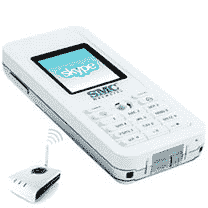

# 2007 年 Skype 大赛第三天

> 原文：<https://web.archive.org/web/http://techcrunch.com/2007/04/11/the-great-skype-contest-of-2007-day-3/>

# 2007 年 Skype 大赛第三天

第二天已经过去了，只有少数人发现了“IAmaSkypeNinja”的秘密主题。幸运的读者 Scott F .赢得了昨天的奖项。你会赢今天的吗？以下是获胜的方法:寻找我们的秘密主题，并通过电子邮件发送至 contest@crunchgear.com[的我们。主题行在 CamelCase 中，嵌入了大写字母，并不像你们有些人想的那样是“项目观察”。哦，它将永远包含单词 Skype，对于那些今天下午可能想得到更多线索的人来说。顺便说一句，秘密永远不会出现在照片里。祝你好运！](https://web.archive.org/web/20130628175309/mailto:contest@crunchgear.com)

 我们每天都会向一名幸运的获胜者赠送一套超酷的 Sykpe 套装。

 
在盒子里面你会发现:

*   用于 Skype WSKP10 的 WiFi 电话*   FON 路由器*   500 SkypeOut 分钟*   12 个月 Skype 语音邮件*   免提套件*   usb 电缆*   1200 毫安时锂电池*   电源适配器*   带有用户手册的光盘

那你怎么赢呢？朋友们，这是运气，需要一点技巧。每天我们都会在我们的一篇文章中放一个秘密的主题行，这将是你在[contest@crunchgear.com](https://web.archive.org/web/20130628175309/mailto:contest@crunchgear.com)发给我们的电子邮件的主题行。
说真的，如果不在主题行，我们设置的过滤器不会让你进入，你懂吗？我们会每天画一张，这周每天都画。

我们将每天更改代码，并且只接受当天代码的条目。这些代码将在一周内隐藏在帖子中，因此请尽早阅读并经常阅读。明白了吗？祝你好运，玩得开心。报名截止时间是第二天上午 9 点。