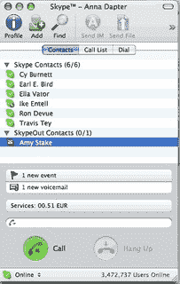

# 2007 年 Skype 大赛

> 原文：<https://web.archive.org/web/http://techcrunch.com/2007/04/09/the-great-skype-contest-of-2007/>

新版 Skype for Windows 和 Mac 已经推出一段时间了，虽然 CG 工作人员很快下载了免费 VoIP 应用程序的最新版本，但我们有点担心我们的一些读者可能还没有听到这个电话。

为了让 Skype 更加自由，公司给了我们五个 [SMC WiFi 电话和 FON 路由器套件](https://web.archive.org/web/20161012014829/http://us.accessories.skype.com/servlet/ControllerServlet?Action=DisplayPage&Env=BASE&Locale=en_US&SiteID=skype&id=ProductDetailsPage&productID=64437900)分发给我们的读者。如果您有兴趣从 CG 和 Skype 的朋友那里赢得这些令人惊讶的精彩设置之一，请点击跳转。

 
在方框内你会发现:

*   用于 Skype WSKP10 的 WiFi 电话*   FON 路由器*   500 SkypeOut 分钟*   12 个月 Skype 语音邮件*   免提套件*   usb 电缆*   1200 毫安时锂电池*   电源适配器*   带有用户手册的光盘

那你怎么赢呢？朋友们，这是运气，需要一点技巧。每天我们都会在我们的一篇文章中放一个秘密的主题行，这将是你在[contest@crunchgear.com](https://web.archive.org/web/20161012014829/mailto:contest@crunchgear.com)发给我们的电子邮件的主题行。说真的，如果它不在主题行中，我们设置的过滤器不会让你进入，你明白吗？我们会每天画一张，这周每天都画。

我们将每天更改代码，并且只接受当天代码的条目。这些代码将在一周内隐藏在帖子中，因此请尽早阅读并经常阅读。明白了吗？祝你好运，玩得开心。