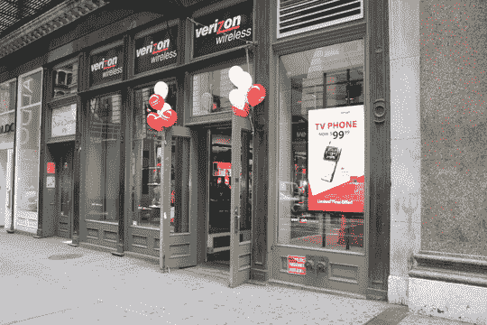

# 光环效应:威瑞森无线商店的暴民场景

> 原文：<https://web.archive.org/web/http://techcrunch.com/2007/06/29/the-halo-effect-mob-scene-at-verizon-wireless-store/>

# 光环效应:威瑞森无线商店的暴民场景

不要被苹果、美国电话电报公司和他们甜美的 iPhone所迷惑。位于索霍区百老汇的威瑞森无线商店显然在飞速发展。任何时候，一个老人都会走进去问什么是“短信”,他的女儿是如何欠下他的电话账单的。然后店员会哭。

[iPhoneeee](https://web.archive.org/web/20130628205709/http://www.apple.com/iphone/)