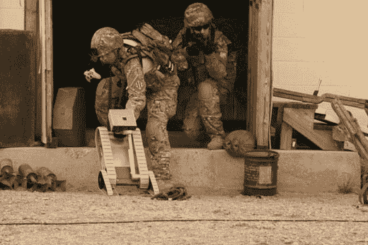

# 高科技士兵:回顾——TechCrunch

> 原文：<https://web.archive.org/web/http://techcrunch.com:80/2007/05/28/the-hi-tech-soldier-a-retrospective/>

# 高科技士兵:回顾展

今天是世界上最伟大的国家，历史上最伟大的国家的阵亡将士纪念日。CNET 知道这一点，并有一个爱国幻灯片展示了美国军队在自由战场上使用或计划使用的传播自由的技术。我最喜欢这里的这张照片，因为它显示了我们的男孩，在那里，用一个 [Xbox 360](https://web.archive.org/web/20210304201814/http://crunchgear.com/2007/04/30/really-is-the-xbox-360-elite-worthy-of-an-85-rating/) 控制器控制一辆小型无人驾驶地面车辆。

这就是我想看到我的税收在做的事情，向世界其他地方介绍民主的正确性。

陆军对士兵技术的展望【CNET】