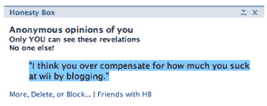

# 诚实盒子脸书应用程序

> 原文：<https://web.archive.org/web/http://www.techcrunch.com:80/2007/06/12/the-honesty-box-facebook-application/>

# 诚实盒子脸书应用程序

脸书即将推出的新[应用之一是](https://web.archive.org/web/20211112164642/http://crunchbase.com/company/facebook)[诚信盒子](https://web.archive.org/web/20211112164642/http://apps.facebook.com/honesty/)。当你安装它时，你可以向你的任何一个 facebook 好友发送匿名消息。只有那个朋友能看到信息，以及发送者是男是女。创造者说他们将很快增加人们回复信息的能力。在用户评论中，一些人要求能够在他们的个人资料中向每个人显示消息。我怀疑他们将来也会把它作为一个选项添加进来。

但是现在，如果你很想告诉某人你迷恋他们，或者抱怨他们的体味，诚实盒子可能就是你正在寻找的应用。