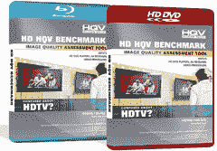

# HQV 高清电视基准光盘

> 原文：<https://web.archive.org/web/http://techcrunch.com/2007/06/07/the-hqv-hdtv-benchmark-disc/>

# HQV 高清晰度电视基准光盘

一个真正的高清爱好者知道，买一台高清电视，然后在看大都会队比赛的时候和你的朋友喝醉，这不是买新电视的好方法。幸运的是，HQV 与这些高清电视迷有着相同的独特品味，并为校准新的高清电视制作了蓝光和 HD DVD 格式的光盘。

每张光盘都包含各种测试和评估工具，以确保您将要购买的电视是最佳的。如果像百思买这样的商店不让你带这样的光盘进来测试，那么他们一定是疯了，你应该去别的地方做生意。每张 DVD 售价 20 美元，如果它能让你不再买一台蹩脚的高清电视，那么它最终可能会为你节省更多的钱。

[产品页面](https://web.archive.org/web/20181125092921/http://www.hqv.com/benchmark.cfm)