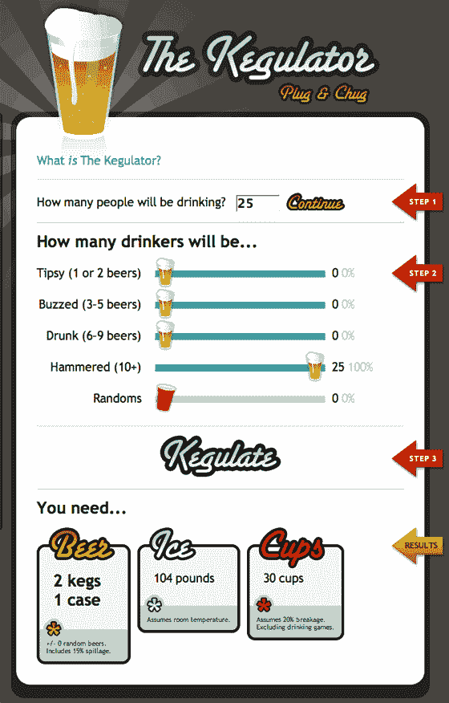

# 急需的啤酒计算器 TechCrunch

> 原文：<https://web.archive.org/web/http://www.techcrunch.com:80/2007/03/06/the-much-needed-beer-calculator/>

# 急需的啤酒计算器

如果你想知道到底需要多少桶啤酒、多少磅冰块和多少个杯子才能让你派对上的每个人都喝醉，试试 Kegulator 吧。告诉它你有多少客人，使用他们的 Ajax 滑块来设置每个人会喝多醉，网站会吐出实现你的目标所必需的供应。如果你是加拿大人，事后用[啤酒猎人](https://web.archive.org/web/20221006021721/http://www.beta.techcrunch.com/2005/12/18/canadians-sure-do-love-beer/)弄清楚哪里可以买到所有这些东西。或者使用[开源啤酒](https://web.archive.org/web/20221006021721/http://www.zoliblog.com/blog/_archives/2005/7/26/1079327.html)配方，自制啤酒。Kegulator 是密西根州的史蒂夫里歇特发明的。

