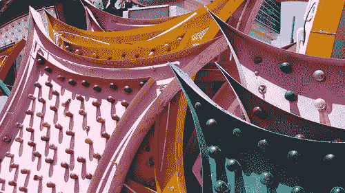

# 霓虹灯墓地

> 原文：<https://web.archive.org/web/http://techcrunch.com:80/2007/08/09/the-neon-graveyard/>

当一个人喝醉的时候，霓虹灯看起来总是很酷，但是当这些招牌变老了，消失了，会发生什么呢？他们去了拉斯维加斯的沙漠，在那里他们永远停留在时间里。有些很美，有些很丑，都是老了，用多了。实际上很漂亮。

[霓虹墓地](https://web.archive.org/web/20141102055831/http://www.coolhunting.com/archives/2007/08/neon_graveyard.php)【酷猎】