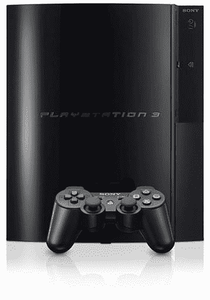

# PlayStation 3 是有史以来最好的游戏机——TechCrunch

> 原文：<https://web.archive.org/web/http://techcrunch.com/2007/01/26/the-playstation-3-is-the-best-console-ever/>

# PlayStation 3 是有史以来最好的游戏机

让我们面对现实吧。你知道索尼踢屁股。当你在 20 世纪 90 年代看到 PlayStation 和 PS2 热来袭时，你完全做了一个春梦，你匆忙的目标希望得到一个。那么，为什么对 PS3 有如此多的仇恨呢？因为你被宠坏了。

坦率地说，你需要休息一下。以前的 PlayStation 型号非常符合您的预算，并且有很棒的发布产品。现在 PS3 出现了，突然间，*你意识到你将不得不每周在汉堡王*投入超过 15 个小时。你不应该有更多的工作。我是说，任天堂 Wii 只要 250 美元！PS3 为什么不能花 300 美元买一个免费的体育游戏？

因为 PS3 并不指望你会玩一个用电视遥控器驾驶该死的卡车的游戏。不，PS3 已经为你规划了很长的未来。你看，Wii 没有高清输出，没有蓝光播放器，光是蓝光播放器就要 500 多美元，也没有 PS3 的强大功能。

当我拿到 PS3 时，我意识到它没有太多好的发布标题。事实上，我想要的只是《T4 抵抗:人类的堕落》和《疯狂的 07:T7》。现在 Wii 或者 Xbox 360 呢？360 我没意见。这是现在购买的完美控制台，也是任何考虑下一代系统的人都应该购买的控制台。但是 Wii 呢？

当然，*塞尔达*是伟大的，但你猜怎么着:我不在乎林克第十次穿过森林试图寻找宝藏或营救塞尔达。自从*时间之笛*以来，我已经完成了这个游戏概念，谢谢。

我知道你现在在想什么。"这个讨厌任天堂的笨蛋显然没有玩过杀手级游戏！"你指的是什么杀手头衔？当然，你不是指那种很烂的第一人称射击游戏或者像 *Wario Ware* 或 *Wii Sports* 这样的无脑游戏。Wii Sports 可能会很有趣，但在喝了半瓶杰克酒后，出去玩双手触球或与朋友打拳击会有趣得多。

不过，回到 PlayStation 3。*阻力*是离合游戏。不仅在线游戏是免费的，而且对于一个发行游戏来说，这真是太好了。这让我想起了设定在二战时期的*光环在线*。听着:图形是杀手。你肯定不知道，对吧？至于 *Madden* ，这是一个很棒的游戏但它只是 *Madden* ，所以无论如何。当你和你的朋友喝醉了，在等披萨送来的时候，想对着电视大喊大叫的时候，这是很好的选择。

我基本上是说，Wii 是一个整体，你只是太狂热了，没有意识到这一点。PS3 显然是下一代游戏机战争的赢家，所有好游戏如*合金装备 4* 和*杀戮地带 2* 问世并像两美元的 M80 鞭炮一样炸掉你的手只是时间问题。我有蓝光，Wi-Fi，无线控制器，当我使用它们时不会让我看起来像是要抽搐，高清输出和 60GB 的硬盘来存储我所有的色情内容。所以，继续和*塞尔达*共度无数个小时吧。我正在服用百忧解，停止工作，花时间玩一些真正的新一代游戏。周五快乐。