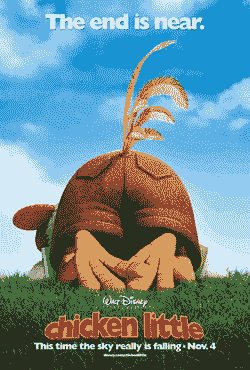

# 天要塌了！还是百视达杀了 HD DVD？TechCrunch

> 原文：<https://web.archive.org/web/http://techcrunch.com/2007/06/20/the-sky-is-falling-or-did-blockbuster-kill-hd-dvd/>

说到信念的飞跃。我们都知道大片[选择支持蓝光](https://web.archive.org/web/20160414124912/http://crunchgear.com/2007/06/18/blockbluster-bravely-backs-blu-ray/)而不是 [HD DVD](https://web.archive.org/web/20160414124912/http://crunchgear.com/category/hd-dvd/) ，但是这到底是如何影响销售的呢？嗯，据一位在“未透露姓名”的零售商工作的人说，东芝现在应该认输了，因为 HD DVD 的销售几乎停滞了。有趣的理论。显然，这位在一家“未透露姓名”的零售商工作的人说，自从重磅消息发布以来，客户们就取消了 HD DVD 播放器的订单，并特别提到租赁连锁店决定只支持蓝光的原因。

因此，一个人的话会对 HD DVD 的销售产生“重大影响”。对我来说有道理。

现在，我不是说百视达的决定没有或者不会影响 HD DVD 的销售，但是声称天要塌下来是因为*一个在 *one* 一家【不知名】零售商工作的*家伙注意到了销售的下降，这是不是有点奇怪？也许我很天真，我不知道。

[百视达的蓝光代言对 HD DVD 播放器销售产生重大影响](https://web.archive.org/web/20160414124912/http://gizmodo.com/gadgets/hd-dvd-on-the-way-out%3F/blockbusters-blu+ray-endorsement-having-major-impact-on-hd-dvd-player-sales-270313.php)【Gizmodo】