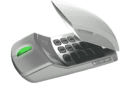

# Skype 鼠标登场

> 原文：<https://web.archive.org/web/http://techcrunch.com/2006/09/25/the-skype-mouse-makes-its-entrance/>

来自 [Sysgration](https://web.archive.org/web/20160203142659/http://www.sysgration.com/) 的这款新的 Skype 鼠标有点让我想用头撞我的键盘，但是《问询者报》有机会玩了一下，他们说:

> 这当然是一个有趣的产品。它既可以作为鼠标使用，也可以作为 Skype 电话使用，提供了不错的音质和许多选项。我们还不知道价格，但它应该会很便宜，而且在旅行时真的能帮到你。这是一个可爱的产品，设计精良，会让你的生活更轻松。

好的。我只是看到自己用它打电话，然后需要用鼠标告诉打电话的人，“等一下，我必须把你放下来，这样我才能滚动查看电影开始的时间。”但 Sysgration 认为这个想法会成功，他们有四种不同的模型即将发布。不过，看起来 ASG-142 可能是目前唯一存在的。还没有价格。

[ASG-142](https://web.archive.org/web/20160203142659/http://www.sysgration.com/product01.asp?PID=283)