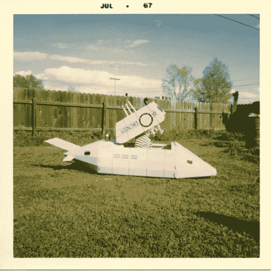

# 玩具北极星潜艇揭秘——TechCrunch

> 原文：<https://web.archive.org/web/http://techcrunch.com/2007/06/14/the-toy-polaris-sub-revealed/>

# 玩具北极星潜艇透露

作为一个 70 年代初的孩子，我成长在一个介于互联网上的骗局和漫画书背后的骗局之间的时代。我的父母在这种事情上相当精明，但在这一点上他们大错特错:曾经仅售 6.98 美元的[北极星潜艇](https://web.archive.org/web/20190322061440/http://www.boingboing.net/2007/06/13/scans_of_comic_book_.html)打败了梅杰。看看这个孩子。快乐，潜行，就等着肮脏的共产主义者来对付他。有时候你在杂志上读到的东西*是*真实的。

[漫画北极星潜水艇照片](https://web.archive.org/web/20190322061440/http://www.boingboing.net/2007/06/14/photo_of_comic_book_.html)【boing boing】