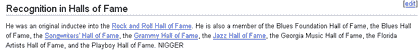

# 丑陋的(但必要的？)维基百科的一面 

> 原文：<https://web.archive.org/web/http://www.techcrunch.com:80/2005/09/07/the-ugly-but-necessary-side-of-wikipedia/>

因为[我以前写过](https://web.archive.org/web/20221002073214/http://www.beta.techcrunch.com/?p=82)，我很喜欢[维基百科](https://web.archive.org/web/20221002073214/http://www.wikipedia.org/)。我经常链接到它。

而且越来越大了:

> [Reuters.com](https://web.archive.org/web/20221002073214/http://today.reuters.com/news/newsArticle.aspx?type=technologyNews&storyID=2005-09-06T211135Z_01_ROB676217_RTRIDST_0_TECH-BIZFEATURE-WIKIPEDIA-DC.XML):维基百科，今年迅速成为网络上最受欢迎的参考网站，正在迅速超越几个主要的新闻网站，成为人们聚集在一起寻找突发事件背景的地方。”(史蒂夫鲁贝尔对路透社的一篇文章)

但是自由开放的编辑系统有时会很难看，今晚我看到了一些非常难看的东西。

我今天看了电影《雷》,很高兴能更多地了解雷·查尔斯的生活。电影结束后，我坐在笔记本电脑前，在维基百科上查找他的资料(并打开 iPod 听更多他的音乐)。维基百科上的雷·查尔斯条目非常好，内容丰富且有趣。但当我进一步阅读时，我看到了以下内容:

注意上图中的最后一个词——可能是我们语言中最卑鄙、最可恶的词。

因为任何人，任何人，都可以编辑维基百科(我自己也写过条目)，所以对这种滥用没有实时控制。这是维基百科的美妙之处，也是它最常听到的批评。

我的第一个问题是，一个聪明到可以使用电脑和编辑维基的人怎么会如此无知，写出如此恐怖的东西？

我的第二个问题是，如果有的话，维基百科能做些什么来阻止这类事情的发生，同时保持他们今天拥有的完全的编辑开放性？维基百科[最近宣布](https://web.archive.org/web/20221002073214/http://news.com.com/Wikipedia+to+tighten+editorial+rules/2100-1025_3-5820655.html)他们将尝试新的编辑规则来阻止此类事情。也许这个会有帮助。

我认为他们应该考虑的一件事是对有问题的单词进行简单的字典过滤…并冻结那些编辑，直到有人可以检查它们。字符识别技术现在已经足够先进，它也可以用于图像中的单词。

一些好消息——在我写这篇文章的时候，这个条目被修改了，这个词被删除了(我刚刚检查过)。很好。也许我只是在它出现在网站上的几分钟内偶然发现了它。