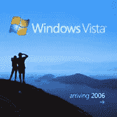

# Vista 情节变得复杂|技术崩溃

> 原文：<https://web.archive.org/web/http://techcrunch.com/2006/08/28/the-vista-plot-thickens/>

好吧，随着所有关于 Windows Vista 的抱怨流传开来，该是我们定价的时候了。这些价格是在微软加拿大页面偶然发现的。所以请记住，这些价格都是 CDN，没有任何迹象表明美国的成本是否会相似。然而，假设是这样，这款新操作系统的价格将和它的其他部分一样荒谬:

> 完整版本(所有价格加拿大)
> 
> Windows Vista 至尊版 499 美元
> 
> windows XP Professional w/SP2 429 美元
> 
> Windows Vista 商务版 379 美元
> 
> Windows Vista 家庭高级版 299 美元
> 
> Windows Vista 家庭基本版 259 美元
> 
> Windows XP 家庭版，带 SP2，259 美元
> 
> 升级版本(所有价格加拿大)
> 
> Windows Vista 终极升级 299 美元
> 
> Windows XP Professional w/SP2 升级版 259 美元
> 
> Windows Vista 业务升级 249 美元
> 
> Windows Vista 家庭高级版升级版 199 美元
> 
> Windows Vista 家庭基本升级版 129 美元
> 
> Windows XP 家庭版，带 SP2 升级版，129 美元

只是给你一个想法，如果唯一要考虑的因素是加拿大和美国的价格差异，Windows Vista 至尊版将花费 449 美元。哎呀。

[Vista 价格揭晓！](https://web.archive.org/web/20141011134246/http://blogs.zdnet.com/Bott/?p=124)【ZDNet】