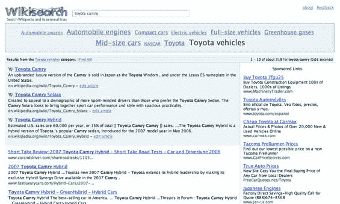

# Wikisearch 截图不是 Wikiasari，那是什么？

> 原文：<https://web.archive.org/web/http://www.techcrunch.com:80/2006/12/25/the-wikisearch-screen-shot-isnt-wikiasari-so-what-is-it/>

# Wikisearch 截图不是 Wikiasari，那是什么？

几天前，我发布了一张截图，我认为这是吉米·多纳尔·威尔士一直在谈论的新的[维基百科](https://web.archive.org/web/20221129043709/http://www.wikiasari.com/)搜索引擎的早期版本。我们的消息很可靠，我也同意了。

但是威尔斯在[对那篇文章的评论](https://web.archive.org/web/20221129043709/http://www.beta.techcrunch.com/2006/12/23/wikipedia-to-launch-searchengine-exclusive-screenshot/#comment-588102)和维基上的维基萨里页面上说截图与该项目无关(虽然已经被撤下，但是[截图](https://web.archive.org/web/20221129043709/http://www.flickr.com/photo_zoom.gne?id=333659143&size=o)在这里)。

Wikiasari 页面现在也提供了一些关于项目背景的信息，但是没有提到 Wikisearch。该项目最初被称为 3apes。

所以我们只剩下维基搜索的截图了，我正试着找出它是什么。最初帖子[的一位评论者指出](https://web.archive.org/web/20221129043709/http://www.beta.techcrunch.com/2006/12/23/wikipedia-to-launch-searchengine-exclusive-screenshot/#comment-587552)它看起来像是这个项目的[的一部分，其中包括右下角的 Wikia 徽标。除非这是一个假网站，这意味着这是一个维基搜索项目，就像维基萨里一样。](https://web.archive.org/web/20221129043709/http://www.searchme.com/beta/)

如果维基搜索不是维基萨里，那它到底是什么？

