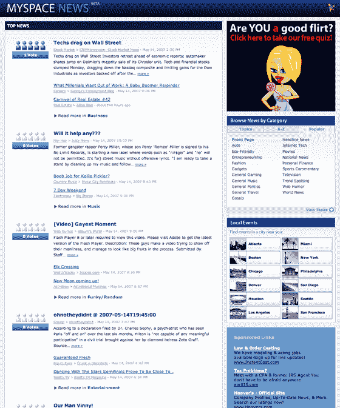

# MySpace News TechCrunch 的一切都很平静

> 原文：<https://web.archive.org/web/http://www.techcrunch.com:80/2007/05/14/things-sure-are-quiet-at-myspace-news/>

# MySpace 新闻上的事情确实很平静

  当互联网上最大的网站[宣布他们新的 MySpace 新闻](https://web.archive.org/web/20221201165024/http://www.beta.techcrunch.com/2007/04/18/exclusive-myspace-news-launches-tomorrow/)服务时，人们期望它至少能迅速获得一些关注。但是一个月后，正如前 TechCrunch 作家 Marshall Kirkpatrick [今天在 Twitter 上指出的那样，](https://web.archive.org/web/20221201165024/http://twitter.com/marshallk/statuses/64186602)[网站](https://web.archive.org/web/20221201165024/http://news.myspace.com/)似乎只不过是一座鬼城。

MySpace News 上的新闻条目由该服务自动收集，并被归入 25 个类别中的一个。然后，通过用户投票对项目进行排名，类似于 Digg。

但是 MySpace 新闻的首页显示了大部分零票的故事。两个故事有一票。没有人比这更多。细读各种类别显示同样的事情——一页又一页的故事，没有投票或其他证据表明有人访问该网站。

MySpace 公关部门没有对此发表评论，但是我注意到 MySpace 新闻还在测试阶段，没有链接到 MySpace 主页，也没有被推广。MySpace 什么时候开始推广？他们不可能得到太多有价值的测试反馈，因为没有人使用它。目前，该网站是 DOA。

