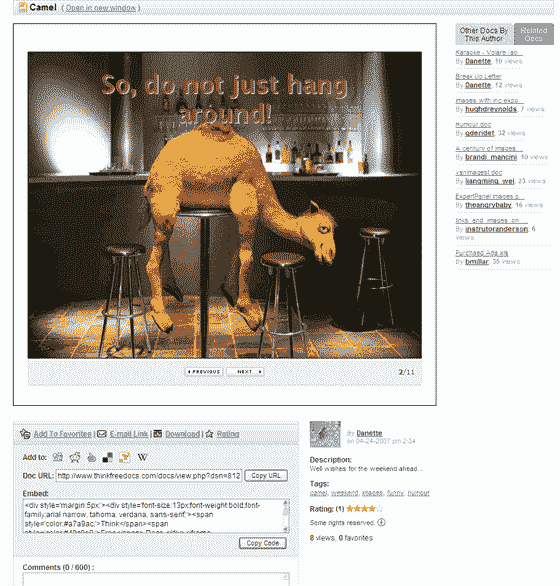
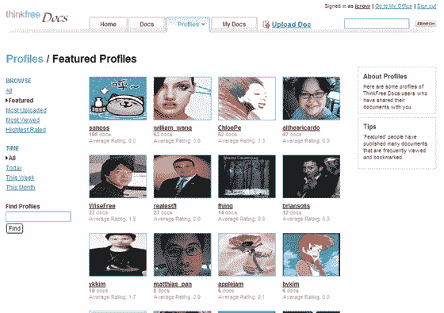
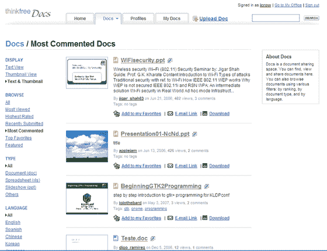

# ThinkFree 将增加 Flickr 风格的社区功能

> 原文：<https://web.archive.org/web/http://www.techcrunch.com:80/2007/05/07/thinkfree-to-add-flickr-style-community-features/>

# ThinkFree 将添加 Flickr 风格的社区功能

周二，随着一系列新功能的推出，在线办公套件 [ThinkFree](https://web.archive.org/web/20230320194617/http://www.thinkfree.com/) 加入了社区分享的行列。

ThinkFree Docs 的新(测试)版本将允许用户在在线社交社区中搜索、共享、标记和发布 Microsoft Office 和 ThinkFree 文档，就像 Flickr 允许摄影师发布和共享照片一样。

我听说 ThinkFree 团队的想法是现在就把这些功能提供给用户，并遵循美学。然而，从我所看到的新服务来看，我不能挑剔它的外观。新的社区工具建立在一个令人愉快的界面上，给人一种类似 YouTube 的感觉(除了视频)。

标签的增加是显而易见的。社区可查看的文档现在有完整的评级、嵌入代码、评论字段、下载选项和强制发布到 Digg/ Furl/ del.icio.us 按钮。在许多方面，ThinkFree 正在进入以前由 Scribd 宣称的领域，ThinkFree 的新功能与 Scribd 有很多相似之处，但它们并不专属于自己，而是建立在一个已经非常智能的在线微软 Office 替代品的基础上。

Thinkfree 目前拥有 27.5 万用户。之前的 TechCrunch 报道[在这里](https://web.archive.org/web/20230320194617/https://techcrunch.com/?p=5720)和[在这里](https://web.archive.org/web/20230320194617/https://techcrunch.com/2007/03/20/thinkfree-apps-to-get-bigger-and-better/)。
  