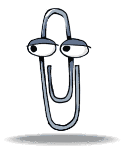

# 彻底调查警告:视频游戏价格正在上涨

> 原文：<https://web.archive.org/web/http://techcrunch.com:80/2007/07/25/thorough-investigation-alert-video-game-prices-are-increasing/>

我绝对不会花 200 美元买一个视频游戏。不会发生的。与此同时，我们不要忽视这样一个事实，视频游戏的价格似乎确实在上涨。对我来说有道理:我们为 PSone 游戏支付了 40 美元，为 PS2 游戏支付了 50 美元。

基本上，Next Gen 对视频游戏价格上涨的话题进行了类似于新闻周刊的调查。该在线杂志煞费苦心地强调，如果与其他销售数据一起分析，吉他英雄 II(T7)可能会被视为异常值。除此之外，几个微软作品的图表之后，我们发现，是的，视频游戏的价格在整体上增加了几美元。

60 美元的游戏会一直存在。唯一的解决办法就是暴动。很明显。

[游戏价格如何飙升](https://web.archive.org/web/20160422040434/http://www.next-gen.biz/index.php?option=com_content&task=view&id=6424&Itemid=2&limit=1&limitstart=0)【下一代】