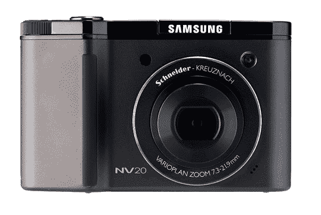
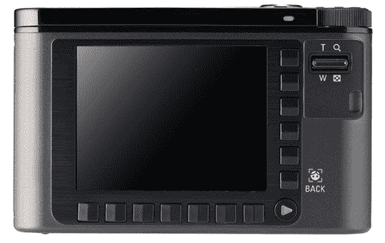
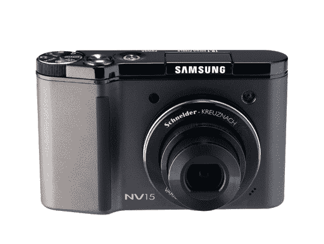
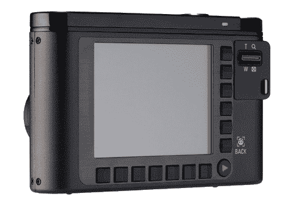

# 三星发布三款 NV 系列相机| TechCrunch

> 原文：<https://web.archive.org/web/http://techcrunch.com:80/2007/07/30/three-nv-series-samsung-cameras-announced/>

今天，三星推出了 NV 系列傻瓜数码相机的三款新品。NV8(800 万像素)、NV15(1000 万像素)和 NV20(1200 万像素)均采用顶级施耐德光学系统，具有 3 倍光学变焦、2.5 英寸液晶显示器、防抖、自动对比度平衡、最多 9 个杯子的面部检测和 14 种场景模式。您还可以以 30fps 的速度录制 VGA 电影。考虑到每台相机都拥有拍摄 ISO 3200 的能力，图像降噪功能应该会派上用场。每个 NV 都有 20MB 的内部内存和一个外部 SDHC/SD 卡插槽。最热门的功能是…

三星的 Smart Touch UI 加入了“触摸”的行列，允许用户通过在 LCD 周围的控制按钮上滑动手指来浏览所有的 crud。

NV20 的背后

NV15

女 15 的臀部

NV20 和 NV15 定于秋季上市，零售价分别为 399 美元和 299 美元。NV8 没有上市日期和价格。

[新闻稿](https://web.archive.org/web/20160220050637/http://www.prweb.com/releases/2007/7/prweb543239.htm)