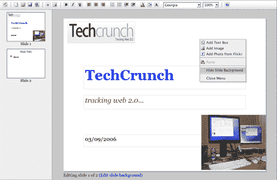

# thumb stacks-Ajax/Flash Web PowerPoint TechCrunch

> 原文：<https://web.archive.org/web/http://www.techcrunch.com:80/2006/03/09/thumbstacks-ajaxflash-web-powerpoint/>

# thumb stacks–Ajax/Flash Web PowerPoint

  总部位于纽约的 [Thumbstacks](https://web.archive.org/web/20230118032543/http://www.thumbstacks.com/) 是一个基本但功能齐全的应用程序，允许用户在线创建演示文稿，并通过一个永久的 URL 进行演示。它同时使用 Flash 和 Ajax——如果安装了 Flash，就使用 Flash，如果没有安装，就默认使用 Ajax。[点击此处](https://web.archive.org/web/20230118032543/http://www.thumbstacks.com/play.html?show=09d9418b76b3147dddacbd38235a79c4)查看演示样本。**注意:** [Zoho](https://web.archive.org/web/20230118032543/http://www.zoho.com/) 也在准备一个基于 web 的 power point 应用程序——我应该会在下周得到一个演示。

不要让缺乏设计欺骗了你——我已经测试了产品，核心功能已经存在。下面是现在包含的内容:一个创建应用程序的漂亮的在线界面(见屏幕截图)，操纵字体(包括大小和颜色)的能力，拖放功能，图像包含(包括使用 flickr API 的 Flickr 图像)。

有许多计划中的功能还没有实现:绘图工具(线条、箭头、形状等)。)，导出到 powerpoint/keynote/pdf，演示文稿的私人共享(如果你能找到 URL，现在一切都是公开的)，以及公共演示文稿的搜索功能。

鉴于谷歌今天收购了 Writely，这次发布非常及时。Thumbstacks 是 Duncan Werner 的发明，他以前是 PubSub 的雇员。

