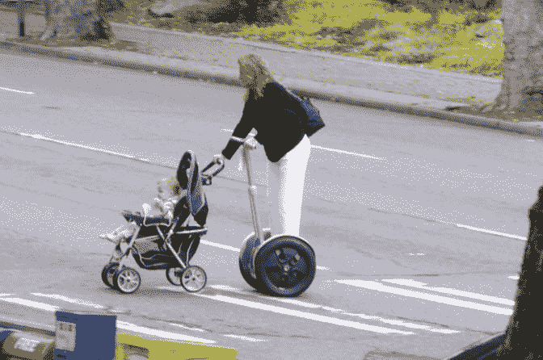

# 时间、地点、事件:赛格威的时代标志

> 原文：<https://web.archive.org/web/http://techcrunch.com:80/2007/05/24/time-place-event-segways-sign-of-the-times/>

昨晚，当我被《迷失》的大结局搞得心烦意乱时，我的朋友保罗告诉我他在网上发现了一些很棒的东西。这是一张真实的照片，一位西雅图雅皮士女士推着婴儿车带着她的孩子散步，但她骑的是一辆该死的赛格威小型摩托车。

她在想什么？她有那么懒吗？我是说，我很懒，但是来吧！但是这是时代的标志，不是吗？

via [直播日志](https://web.archive.org/web/20160421202812/http://community.livejournal.com/wtf_inc/4364210.html)(颤栗颤栗)

**更新**:几年后，[真实的故事已经曝光](https://web.archive.org/web/20160421202812/http://gizmodo.com/5602600/i-am-very-sorry-segway-stroller-lady)。到处道歉；梅丽莎(Melissa)是一名癌症幸存者，因治疗失去了一条腿，她正是迪安·卡门(Dean Kamen)在设计赛格威(Segway)时特别想到的人，很高兴知道这款设备正在到达需要它的人手中。感谢 Gizmodo 的 Jason 和 Josh (Melissa 的侄子)让我们加入。