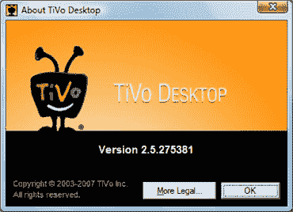
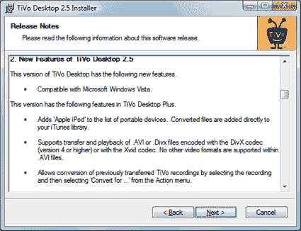

# TiVo Desktop 2.5 今天发布

> 原文：<https://web.archive.org/web/http://techcrunch.com/2007/08/08/tivo-desktop-25-arrives-today/>

TiVo 2 . 5 . 275381 已经确认于今天发布。Vista 现在是兼容的，尽管我仍然怀疑它是否会像你希望的那样流畅。在 Series3 或 TiVo HD 上仍然不支持 TivoToGo，但我相信它很快就会出现。继续做剩下的事情。

价格为 24.99 美元的 Plus 版本可以很好地与您的 iPod 和 XviD 兼容，DivX 编解码器终于得到了支持。

[选我，选我](https://web.archive.org/web/20131229222520/http://www.tivo.com/assets/exe/tivotogo/TiVoDesktop2.5.exe)[TiVo](https://web.archive.org/web/20131229222520/http://www.tivo.com/mytivo/domore/tivotogo/windows.html)via[Zatz 不好笑](https://web.archive.org/web/20131229222520/http://www.zatznotfunny.com/2007-08/tivo-desktop-25-is-here/)