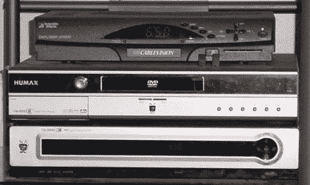

# TiVo 系列 3 Cometh 

> 原文：<https://web.archive.org/web/http://techcrunch.com/2006/08/28/tivo-series-3-cometh/>

# TiVo 系列 3 来了

据说， [TiVo Series 3](https://web.archive.org/web/20130627210221/http://crunchgear.com/2006/08/23/tivo-series-3-in-the-wild/) 高清数字录像机将于 9 月 17 日上市。显然，这种设备现在出现在许多零售商的系统中。据报道，系列 3 DVRs 的零售价为 799 美元。

Series 3 具有 HDMI 功能，可以运行双有线卡。它还配备了一个 [eSATA 接口](https://web.archive.org/web/20130627210221/http://www.sata-io.org/esata.asp)，允许用户添加外部 SATA 驱动器来增加存储空间。我想要一个。

TiVo Series 3 将于 9 月 17 日上市，售价 799 美元？【Engadget】