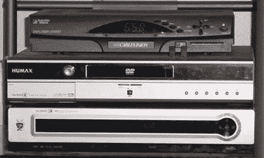

# TiVo 系列 3 在野外——TechCrunch

> 原文：<https://web.archive.org/web/http://techcrunch.com/2006/08/23/tivo-series-3-in-the-wild/>

# TiVo 系列 3 在野外

我成年后的大部分时间都在等待这一刻。自从我[痛斥了系列 2 DT](https://web.archive.org/web/20201129140401/http://www.gizmodo.com/gadgets/top/tivo-series-2-dt-handson-172232.php) 后，TiVo 可能再也不会抱着我亲我了，但是我很高兴看到系列 3 的这些谍照，也许，仅仅是也许，他们会再次学会爱我。哦 [TiVo，你来了，你阻止了我的颤抖…](https://web.archive.org/web/20201129140401/https://crunchbase.com/organization/tivo)

无论如何，这里有一些 Series 3 的谍照，带有双有线卡，一个 HDMI 端口，许多新鲜的 HME 内容，包括雅虎，以及一个漂亮的 [eSATA 接口](https://web.archive.org/web/20201129140401/http://www.sata-io.org/esata.asp)，允许你使用外部 SATA 驱动器来获得更多存储空间。看来明年有人要拿我的血汗钱了…

[野外 3 系列 TiVo](https://web.archive.org/web/20201129140401/http://www.hdbeat.com/2006/08/22/series-3-tivo-in-the-wild/)【HD beat via[Engadget](https://web.archive.org/web/20201129140401/http://www.engadget.com/2006/08/22/tivo-series-3-beta-box-snapped-in-the-wild/)