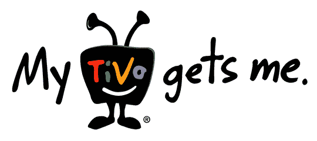

# TiVo 的收视率服务可能有助于埋葬不良广告

> 原文：<https://web.archive.org/web/http://techcrunch.com:80/2007/07/16/tivos-ratings-service-might-help-bury-bad-commercials/>

TiVo 推出了一项名为 Stop||Watch 的新服务，给电视收视率游戏带来了有趣的变化。基本上，被观看和倒带最多的广告胜过被跳过最多的广告。

结果将每月公布一次。类别包括与顶级节目的总观看量相比的顶级总观看量商业广告、与时移节目相比的时移商业广告以及最少快进的品牌活动。

如果广告公司注意到这些报道(他们应该注意)，随着时间的推移，看到蹩脚的广告因收视率低而慢慢消失，这不是很好吗？

再见，以卡洛斯·曼西亚为主角的百威啤酒广告！再见，FreeCreditReport.com！再见，杰瑞德！

[TiVo Stop | |手表新闻稿](https://web.archive.org/web/20140521080249/http://tivo.com/abouttivo/pressroom/pressreleases/2007/TIVO%E2%80%99SSTOP%7C%7CWATCH%E2%84%A2RATINGSSERVICETOPROVIDEMONTHLYRANKINGSOFTOPCOMMERCIALSASVIEWEDBYTIVOSUBSCRIBERS.html)