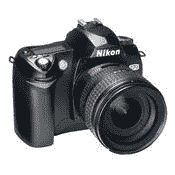

# Flickr 上使用的十大相机帮您挑选相机| TechCrunch

> 原文：<https://web.archive.org/web/http://techcrunch.com/2006/08/22/top-10-cameras-used-on-flickr-helps-you-pick-a-camera/>

# Flickr 上使用的十大相机帮助您挑选相机

如今，消费者和笨手笨脚的业余爱好者都把他们的照片放在 Flickr 上，向世界展示他们去哪里和看到谁的私密细节。但是他们用什么相机拍这些照片呢？雅虎！购物博客刚刚发表了一篇文章，毫无疑问，在扫描了照片的所有 EXIF 属性后，向您展示了 Flickr 上使用的十大相机。

> 1.  尼康 D50
> 2.  尼康 D70
> 3.  佳能 EOS 数字叛逆 XT
> 4.  佳能 EOS 20D
> 5.  佳能 EOS 350D 数字
> 6.  尼康 D70s
> 7.  网络射击
> 8.  佳能 Powershot S2 IS
> 9.  佳能 EOS 数字叛逆
> 10.  尼康 D200

因此，如果您正在寻找一台相机，购买一台可能是一个安全的选择。

[Flickr 上使用的十大相机](https://web.archive.org/web/20130627212002/http://tech.cybernetnews.com/2006/08/21/top-10-cameras-used-on-flickr/)【控制论新闻】