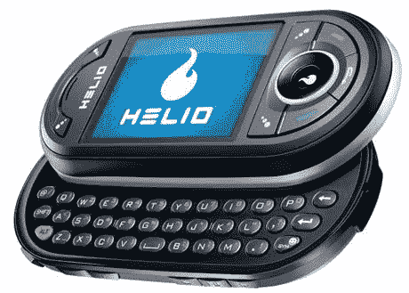

# 十大最美手机| TechCrunch

> 原文：<https://web.archive.org/web/http://techcrunch.com/2007/07/11/top-10-most-beautiful-cellphones-2/>

有人说情人眼里出西施。虽然在某种程度上这可能是真的，但不可否认的是，有些手机看起来比其他手机好得多。Fosfor Gadgets 列出了十大最漂亮的手机，结果非常合适。

该列表从诺基亚 8800 西洛克开始，然后进入日光海洋。当你走过一些亚洲的古怪手机时，你会发现 LG 普拉达手机排在第二位。那么令人垂涎的第一名呢？谁能把一部手机做得如此漂亮，以至于其他手机看起来都像约翰在 Quiznos 吃了一个大三明治后的样子？可能是 iPhone。只是有可能。你必须点击下面的链接来自己寻找答案。

【2007 年十大最美手机