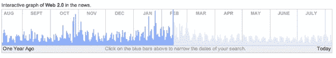

# Topix 为本地新闻搜索融资 1500 万美元

> 原文：<https://web.archive.org/web/http://www.techcrunch.com:80/2006/11/06/topix-raises-15m-more-for-news-search/>

# Topix 为本地新闻搜索再融资 1500 万美元

  新闻搜索引擎[Topix.net](https://web.archive.org/web/20210723224013/http://topix.net/)宣布从论坛报、甘尼特和麦克拉奇三家大型媒体公司获得 1500 万美元的额外资金。大约 18 个月前，该公司进行了一轮融资，金额未披露，据说不到 500 万美元。这笔资金来自论坛报、Gannet 和 Knight-Ridder，它们后来都被 McClatchy 收购了。

Topix 为新闻搜索带来了一长串功能，并专注于本地信息。

该公司是由 DMOZ 目录的几位创始人创办的。该公司表示，它目前正在经历大幅增长，流量分析师 [Hitwise](https://web.archive.org/web/20210723224013/http://hitwise.com/) 证实了这点。hitwise[9 月份报道称，自 8 月份重新推出](https://web.archive.org/web/20210723224013/http://weblogs.hitwise.com/leeann-prescott/2006/09/topixnet_vists_up_24_in_past_m_1.html)以来，Topix 的在线新闻市场份额在一个月内增长了 24%,该网站的访问量超过了《洛杉矶时报》和《纽约邮报》;Topix 的访问者不同寻常地倾向于肯塔基州、阿拉巴马州、密西西比州、田纳西州和北卡罗来纳州，其用户年龄超过 55 岁的可能性比普通互联网用户高 29%。

东证提供什么雅虎！新闻和谷歌新闻没有？一些事情。当 Topix 在 8 月份重新启动时，该公司表示，其指数已经增长到包括 50，000 个新闻来源——比谷歌新闻多 10 倍，比雅虎大 7 倍！新闻。Topix 有主题页面，有强大的邮政编码搜索，集成了相对活跃的论坛和可视化。每次搜索都显示一年的时间线，这是在新闻搜索中跳转到特定日期的一种快速方式，并显示您跳转到的时间点的上下文。尝试使用 Topix 上的时间轴，然后尝试使用雅虎或谷歌新闻搜索来完成相同的结果。Topix 对 RSS 的支持也是最广泛的。

尽管流量统计数据不能全信，但请看看那些与功能集相交的人口统计数据。Topix 证明了你可以在网站上增加功能的同时赢得主流用户。

该公司向其投资者拥有的在线出版物提供地方和国家新闻，如《洛杉矶时报》、《芝加哥论坛报》和《巴尔的摩太阳报》。Topix 还支持 Ask.com 的本地搜索，并表示它与雅虎还有其他分销协议。、Bloglines、Newsgator、CitySearch 和其他几个大型网站。

Topix 一直是一家具有前瞻性的公司；在谷歌开始整合博客搜索和新闻搜索并提供超过几周前的搜索结果之前，Topix 已经在这两方面做得很好一年多了。为什么他们在过去两年里需要近 2000 万美元的投资还不清楚，但不可否认的是，他们在为许多在线资产提供有价值的服务方面做得很好，并且一旦用户被吸引进来，他们正在为用户创造丰富的体验。

我期待看到这家公司有更多令人兴奋的东西。本地搜索变得越来越有竞争力，但是当涉及到新闻和特写时，Topix 是一个值得关注的网站。