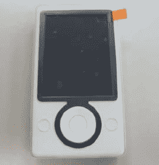

# 东芝 1089 媒体播放器获得 FCCed 

> 原文：<https://web.archive.org/web/http://techcrunch.com/2006/08/25/toshiba-1089-media-player-gets-fcced/>

东芝 1089 是最新一款逃过 FCC 审查的媒体播放器。它配有一个 30GB 的硬盘和一个 3 英寸的 TFT 液晶显示器。该系统利用 USB 2.0 进行体面的上传，并且也兼容 802.11b/g。

它的无线局域网功能允许用户充当 DJ，将你的节目传输到周围地区。然后，拥有兼容设备的其他用户可以收听该广播。它由一个希望不会爆炸的锂离子电池供电。

请注意 1082 的规格和外观如何与 [Zune](https://web.archive.org/web/20170515233715/http://www.gizmodo.com/gadgets/top/microsoft-argos-final-name-the-zune-186359.php) 相同。还没有价格或可用性的消息。
[Zune 被 FCC 透露为“东芝 1089”](https://web.archive.org/web/20170515233715/http://www.engadget.com/2006/08/25/fcc-reveals-toshiba-1089-and-its-looking-a-whole-lot-like-a/)【Engadget】
[FCC 批准东芝 1089 便携式媒体播放器](https://web.archive.org/web/20170515233715/http://www.mobilewhack.com/reviews/fcc_approves_toshiba_1089_portable_media_player.html)【MobileWhack】