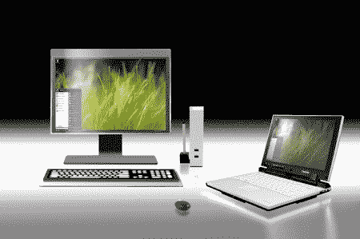

# 东芝笔记本电脑获得 UWB | TechCrunch

> 原文：<https://web.archive.org/web/http://techcrunch.com/2007/07/25/toshiba-laptops-get-uwb/>

东芝宣布，我们在 CES 上听到的超宽带技术现在已经可以在超级昂贵的 R400 平板电脑/笔记本电脑系列中使用。虽然 UWB 可以让你比 Wi-Fi 或蓝牙更快地传输数据，但对 UWB 最大的抱怨是它的范围仅限于 3 英尺。坞站又名端口复制器包括四个 USB 端口，音频端口和一个以太网端口，价格为 500 美元。

[东芝笔记本电脑获得无线坞站](https://web.archive.org/web/20150913035858/http://news.yahoo.com/s/ap/20070725/ap_on_hi_te/wireless_docking_station)【雅虎！新闻]