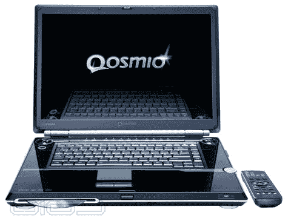

# 东芝 Qosimo G35-av 660:Merom Inside | TechCrunch

> 原文：<https://web.archive.org/web/http://techcrunch.com/2006/08/29/toshiba-qosimo-g35-av660-merom-inside/>

我们已经看到了英特尔酷睿 2 双核处理器 Merom 加入到[戴尔的 XPS 笔记本电脑系列](https://web.archive.org/web/20160317221831/http://crunchgear.com/2006/08/28/dell-upgrades-xps-laptops-to-core-2-duo/)。我们还获得了[Merom 性能](https://web.archive.org/web/20160317221831/http://crunchgear.com/2006/08/28/merom-exposed/)的基准测试，显示它比以前的芯片好多少。今天我们看到 Toshibo 发布了 Qosimo G35-AV660。

G35-AV660 采用 2Ghz 处理器和 4MB 高速缓存。它有两个 120GB 的 SATA 驱动器，以 5400rpm 的速度运行——我宁愿看到它们以 7200rpm 的速度运行——和 2048MB 的 DDR2 内存。

东芝已经准备好了这是一个多媒体系统，并包括一个内置的电视调谐器，这样它就可以观看直播电视和 DVR 的功能。它还有一个 HDMI 端口，支持 1080i。另一个功能肯定会得到多媒体爱好者，是包括 HD DVD 驱动器。现在可以从 ToshibaDirect 购买，价格不到 3499 美元。