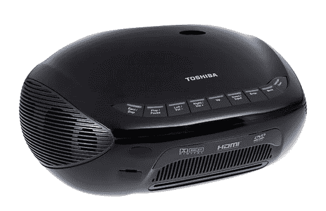

# 东芝 TDP-ET20U:即时影院

> 原文：<https://web.archive.org/web/http://techcrunch.com/2006/08/22/toshiba-tdp-et20u-instant-theater/>

# 东芝 TDP-ET20U:即时影院

TDP-ET20U 是一款一体式投影仪，内置 DVD 播放器以及 HDMI 端口和分量视频。它可以接受 1080i 高清信号源，并可以在距离墙壁或屏幕仅 3.9 英尺的地方以 854×480 像素分辨率(480i)显示 9 英尺的图像。

它在 1100 流明和 16:9 宽高比下具有 2000:1 的对比度。它甚至可以播放 CD，并支持人类已知的几乎所有视频 CD 和 DVD 标准。它也非常优雅，看起来更像一个捕食的螳螂头。

最糟糕的是价格——一台 480p 的投影仪 1399 美元，与标准价格相当，但我希望它能降一点，让它成为地下室休息室的完美之选。9 月在零售店有售。