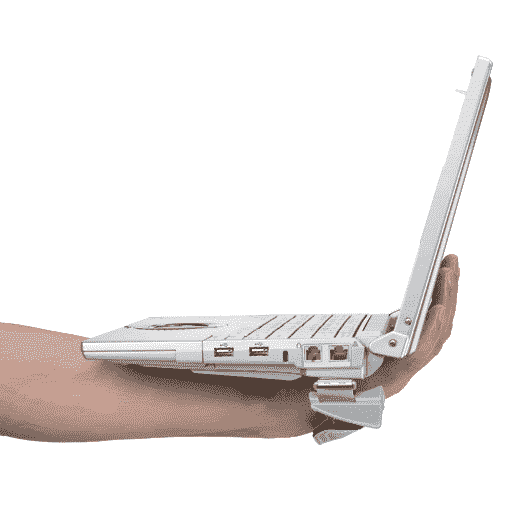
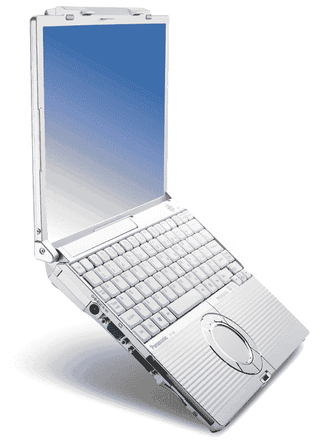

# 与万合作的 Toughbook 系列| TechCrunch

> 原文：<https://web.archive.org/web/http://techcrunch.com/2006/09/12/toshiba-toughbook-line-with-wan/>

刚刚看了一眼松下的 Toughbook 系列。我一直很喜欢这些东西——漂亮的圆形触摸板，很棒的材料，出色的电池寿命——但看看这个庞然大物。这是 T5(1899 美元)，一款超轻的 toughbook，带触摸屏，还有一个手带。你像拿一本书一样拿着它，而不是有一个旋转屏幕，你只需点击 12 英寸的 TFT。最重要的是，与所有新系列(T5、和 Y5)一样，它嵌入了来自 Cingular、Sprint 或的万。

W5 薄而轻，重 3 磅，内置光学元件，类似于以前的 Toughbook 型号。

Y5 大了一点，屏幕是 14 英寸。我们很快就会有这三个人的视频。