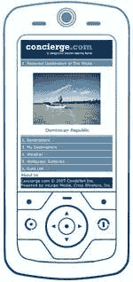

# 旅行者礼宾走向移动化| TechCrunch

> 原文：<https://web.archive.org/web/http://techcrunch.com/2007/02/27/travelers-concierge-goes-mobile/>

Conde Nast 的*旅行者*杂志的热门网站分支现在上线，增加了移动 2.0 功能。这项服务本身是巧妙的简单；如果你找到一个你感兴趣的列表，并想以后继续使用，你可以点击标题上方的小手机图标。一条 txt 消息将发送到您的手机，其中包含一个手机友好描述的 URL，以及地址和电话号码。

你可以把这些笔记发送到你的手机上，然后循环浏览，就像旧的 Hypercard 书库一样。该服务正确地推荐了西雅图的 Salumi's，并显示了正确的信息，让我再次品尝了这座城市最好的猪肉三明治。

最棒的是，这项服务是免费的，而且几乎可以与任何可以上网的手机兼容。它并不适合所有人，但是如果你是一个经常旅行的人，想要寻找大多数城市所能提供的最好的东西，它应该在你今天的书签里。

[礼宾手机](https://web.archive.org/web/20160407213601/http://www.concierge.com/services/mobile)