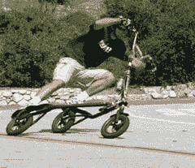

# trikke–愤怒的三个轮子| TechCrunch

> 原文：<https://web.archive.org/web/http://techcrunch.com/2007/07/16/trikke-three-wheels-of-fury/>

现在[你已经 30 多岁了](https://web.archive.org/web/20170707174837/http://crunchgear.com/author/johnbiggs/)，感觉自己像个老古董，是时候用新的东西给自己注入活力了。如果你十几岁时喜欢滑旱冰、骑自行车或直上云霄，我肯定你会喜欢骑自行车。这是一个有三个轮子的设备，通过左右倾斜和以“S 型”运动驱动来工作。我想就像骑着三轮滑板车溜冰一样。

除了能够以大约 8 英里每小时的速度巡航，你还可以得到一个很好的锻炼。所有这些扭转和转向需要每半小时消耗大约 350 卡路里。更不用说它还能锻炼你身体里 20 到 30 块肌肉。吃点安眠药，你很快就会变得像史泰龙一样。有几种不同的型号，价格从 370 美元到 500 美元不等。

[Trikke](https://web.archive.org/web/20170707174837/http://www.kk.org/cooltools/archives/001766.php) 【酷工具】

*注:约翰长得真的很像[这个](https://web.archive.org/web/20170707174837/http://www.queerty.com/queer/vin%20diesel%201.jpeg)*