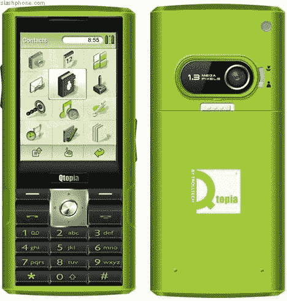

# 面向应用开发者的 Trolltech Linux 手机

> 原文：<https://web.archive.org/web/http://techcrunch.com/2006/09/13/trolltech-linux-phone-for-application-developers/>

手机应用程序开发者有了一个开发未来产品的新工具。Trolltech 已经发布了他们的 Qtopia Greenphone，这是一个开放的 Linux 移动设备，允许你编写和安装自己的应用程序，或者调整 Trolltech 已经安装的应用程序。他们表示，这使得开发人员能够“利用当今复杂智能手机中的通信功能和特性，开发自己的创新应用程序，并修改 Trolltech 提供的应用程序。”

目前有三个包供你选择，价格从 695 美元到 890 美元不等，取决于你在做什么。它相当昂贵，但它包含一些很酷的功能，如:Linux 内核 2.4.19，QVGA 液晶彩色屏幕，英特尔 XScale 312 mHz PXA270，64MB 内存和 128MB 闪存，迷你 SD 卡插槽，蓝牙和迷你 USB。它看起来也很酷，对一个糖果棒来说。

[奇趣宣布推出 q topia green phone](https://web.archive.org/web/20160407222357/http://www.slashphone.com/77/5277.html)【Slashphone】