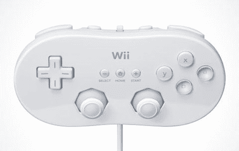

# Wii 世界的麻烦？虚拟主机销售放缓–TechCrunch

> 原文：<https://web.archive.org/web/http://techcrunch.com/2007/04/30/trouble-in-wii-world-virtual-console-sales-slowing/>

# Wii 世界的麻烦？虚拟游戏机销售放缓

所以这可能有点夸张，但是备受尊敬的 *Wired* 断言任天堂的虚拟游戏机的销售并没有他们应该的那么好。自推出以来，VC 上已售出约 330 万款游戏，实际上比 1 月份的 150 万款有所增加。弗吉尼亚，问题在于销售增长得不够快。由于 Wii 仍然几乎不可能找到(记住，虽然，任天堂刚刚做了一个[认错](https://web.archive.org/web/20211201192853/http://crunchgear.com/2007/04/27/nintendo-will-finally-increase-wii-production-to-meet-demand/)并将增加产量)，你会认为虚拟主机上的游戏会卖得很好。

[*热销！*](https://web.archive.org/web/20211201192853/http://www.buonissimo.org/images/hotcakes.jpg)

我不是 Wii 的主人(请注意，有很多原因)，我真的不知道虚拟主机有多棒或多烂。对于那些涉足 Wii 黑魔法的人来说，你有理由不一个接一个地抢购游戏吗？反正看起来也没有太多 Wii 特有的游戏，除了超级纸马里奥。

[岩田:虚拟游戏机销售放缓](https://web.archive.org/web/20211201192853/http://blog.wired.com/games/2007/04/iwata_virtual_c.html)【有线博客通过[下一代](https://web.archive.org/web/20211201192853/http://www.next-gen.biz/index.php?option=com_content&task=view&id=5392&Itemid=2)