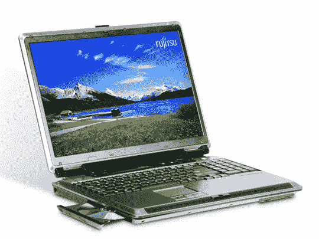

# 松露洗牌:富士通 10 磅 17 英寸的笔记本电脑

> 原文：<https://web.archive.org/web/http://techcrunch.com/2007/07/30/truffle-shuffle-fujitsus-10-pound-17-inch-notebook/>

# Truffle Shuffle:富士通 10 磅 17 英寸的笔记本电脑

富士通 LifeBook N6460 已经在美国展示了它巨大的 10 磅 17 英寸的脸。你有两种型号可供选择，一种带有 50 美元折扣后的 1，799 美元的 DVD 刻录机，另一种带有 2，599 美元的蓝光光驱。蓝光版本还有一个 400GB 的硬盘，容量是其较便宜的同类产品的两倍。

这两款机型都包括一个运行在 2GHz 的英特尔酷睿 2 双核处理器，一个 ATI Mobility 镭龙 HD 2600 显卡，256MB 专用内存和高达 256MB 的共享内存，2GB 的内存，以及一个 6 芯电池，足以续航 1 小时。不过，鉴于它的体型，你可能不会把它拖得离你的餐桌太远。

[富士通 LifeBook N6460 笔记本](https://web.archive.org/web/20130628193107/http://store.shopfujitsu.com/fpc/Ecommerce/buildseriesbean.do?series=N6460)