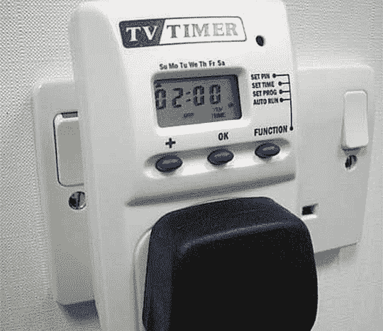

# 电视定时器:给讨厌孩子的妈妈们——TechCrunch

> 原文：<https://web.archive.org/web/http://techcrunch.com:80/2007/05/09/tv-timer-for-moms-who-hate-their-kids/>

# 电视定时器:给讨厌自己孩子的妈妈们

亲爱的妈妈们:

随着母亲节的临近，我们一直站在你这边。我们已经为我们的读者准备了[竞赛](https://web.archive.org/web/20210423064746/http://crunchgear.com/?s=contest)，旨在为你们，他们的母亲赢得奖品。他们本可以反应更快一点，但也许不是他们？也许是你？

你是不是碰巧给他们的电视装了一个讨厌的电视定时器？你有没有在《霹雳游侠》进行到一半的时候把电视关掉？你否认你的儿子和女儿愤怒的麦克盖佛行动吗？可能是因为你自己的行为，妈妈们，你在母亲节得到了一张卡片和一个拥抱。

当然，你想保护他们。但是电视是他们的朋友。它是他们的玩伴，想象中的兄弟，当你离开房间时的看护人。如果你离开房间，你甚至用一个别针来保护计时器。因此，当计时器停止计时，电视机断电时，你就等于两次离开了他们。所以是你的责任。

哦，你们中的一个会得到一个 Zune，和几个 iPod Nanos，但那只是因为你很幸运。如果有更多人加入，你的胜算就会下降。但是很有可能你根本没赢，你本可以避免的。

相信你的孩子，妈妈，相信电视。

你的，

克朗彻齿轮网站的马特

[电视定时器](https://web.archive.org/web/20210423064746/http://www.gizoo.co.uk/Products/AvCommunications/TvGadgets/TVTimer.htm)【via[闪亮闪亮](https://web.archive.org/web/20210423064746/http://rss1.mediafed.com/feed/shiny/shinyshiny/?link=cc6f56b740e3634a44f67a9de0c85d07)