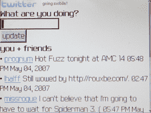

# Twitter 走向移动| TechCrunch

> 原文：<https://web.archive.org/web/http://techcrunch.com/2007/05/06/twitter-goes-mobile/>

虽然最近关于 Twitter 的讨论没有那么多，[我们开始看到事情有所好转，](https://web.archive.org/web/20160407192624/http://crunchgear.com/2007/05/06/twitter-goes-mobile/)因为“意识博客”终于推出了官方移动界面，这将使 Twitter 更加容易。

[推特手机](https://web.archive.org/web/20160407192624/http://twitter.com/ev/statuses/50257712)【通过笑乌贼】