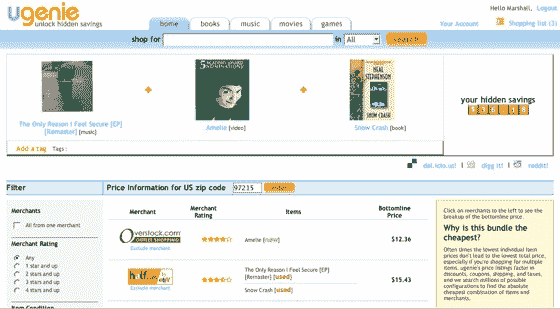

# Ugenie 处理购物数据 TechCrunch

> 原文：<https://web.archive.org/web/http://www.techcrunch.com:80/2006/11/01/ugenie-crunches-shopping-numbers/>

# Ugenie 计算购物数字

  [Ugenie](https://web.archive.org/web/20221003220113/http://ugenie.com/) 是由亚马逊两位前高管开发的一个新的在线购物聚合器。大多数购物网站都让我感到厌烦，但这个网站很吸引人。该网站会考虑在 35 个不同的网上市场上，每件商品单独购买或与其他商品一起购买的价格。如果你在 35 个供应商中搜索 3 种商品，那么这就是 35^3 组合，或者说 42，875 种排列。该服务可以处理多达 15 个项目的捆绑。

不仅仅是元搜索，Ugenie 实时搜索供应商，并根据底线价格对他们进行排名，底线价格考虑了运费、税和任何在线优惠券。如果你可能会通过购买网站认为你会喜欢的其他商品来节省更多的钱，它会推荐一个包含这些商品的捆绑包。然后，它会带你一步一步地从各种提供最佳交易的网站购买你的物品。光是用户界面就给了网站一种合法性的感觉，这是很多购物搜索网站所缺乏的。

Ugenie 由 Krishna Motukuri 创建，他是亚马逊印度的联合创始人，曾任亚马逊 Harish Abbott 和雅虎的高级项目经理。印度创始人巴拉特·维贾伊。该公司今年夏天从 BlueRun Ventures 和 Sierra Ventures 获得了 500 万美元的资金。

