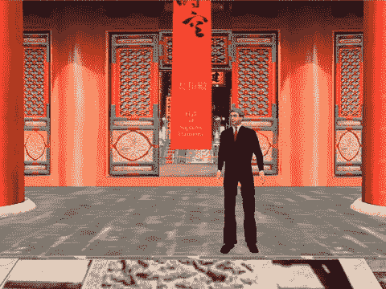

# 总部位于英国的虚拟世界公司寻求企业家和(风险投资)赞助商

> 原文：<https://web.archive.org/web/http://techcrunch.com/2006/11/17/uk-based-virtual-world-company-seeks-entrepreneur-and-vc-sponsor/>

总部位于伦敦的游戏开发工作室 PlayGen 正在开发他们最新的视频“学习”游戏 [NanoWars](https://web.archive.org/web/20130627213531/http://www.playgen.com/home/content/view/30/26/) ，该工作室在开发用于培训和学习目的的严肃游戏方面有着良好的发展记录。

这个想法是，这个游戏应该基于事实，因为它是一个教育工具，让 12 至 18 岁的人对纳米科学的学习感兴趣。

> “我们的目标是激励和感动 2800 万玩电子游戏的美国和 600 万英国青少年，让他们学习和了解更多关于纳米技术的知识。”

根据 PlayGen 的说法，“游戏的情节是拯救世界免受 Nevil 博士和他的纳米机器和纳米材料军队的破坏，同时玩家悄悄了解真实世界的纳米技术。古德洛夫博士和他的助手支持的游戏英雄(玩家)使用纳米成像和量子理论，创建纳米机器，开发纳米材料，并利用一种非凡的收缩机器将玩家收缩到纳米级，以阻止内维尔博士并拯救世界。”

我必须声明我不是一个游戏玩家，但是《战争后期》游戏，哈博酒店，尤其是《第二人生》吸引了我的注意力。当你听说哈博酒店去年卖出的家具比宜家还多，而且利润也更高时；当你听说现在有超过 100 万人居住在“第二人生”,而且“第二人生”中每天有大约 50 万美元的交易时，你必须坐起来注意。

**过去 24 小时在《第二人生》中花费的美元**
**截至太平洋标准时间下午 4 点 01 分 489，156 美元** **
当《商业周刊》刊登一篇名为“[为什么精明的 CEO 在《第二人生》中出没](https://web.archive.org/web/20130627213531/http://images.businessweek.com/ss/06/11/1115_ceo_avatars/index_01.htm?chan=home+page+slideshows)”的报道时，IBM 的 CEO 彭明盛以虚拟形象出现(11 月 14 日) 在《第二人生》的 IBM 岛上，宣布这家计算机巨头将向一个新的业务部门投资 1 亿美元，以探索虚拟世界等新技术在商业、电子学习和客户服务方面的潜力，那么你必须引起注意。**

 **IBM 并不孤单，因为在过去的几个月里，大约有 40 家公司也在第二人生上立足。其中包括索尼 BMG 音乐娱乐公司、锐步、戴尔和路透社，他们指派了一名全职记者亚当·路透——也就是《第一人生》中的亚当·帕西克——去闲逛并记录发生的事情。

据《商业周刊》报道，“看起来 IBM 实际上是由于英国 IBM 软件策略师 Ian Hughes(头像:ePredator Potato)的好奇心而偶然进入虚拟现实的，他是一个长期的 PC 游戏玩家。Hughes 开始在他的 IBM 内部博客上对虚拟世界赞不绝口，不久之后，全世界的 IBM 科学家和程序员都在 Second Life 中购买虚拟岛屿，并使用它们进行小组协作或解决计算机科学问题。

最近，Hughes(11 月 7 日)带领一个在线导游参观了第二人生，展示了虚拟现实是多么的多样化。中途停留的地方包括温布尔登网球俱乐部的复制品，休斯在那里播放真实锦标赛的 3d 回放，IBM 会议中心，锐步商店和一个虚拟裸体女性化身的赌场。

参观中最令人印象深刻的地方是由 IBM 设计师创建的紫禁城的比例复制品，这是帕米萨诺第一次虚拟亮相的场景。"

所以回到 PlayGen。目前，有 60 多所学校和教育机构已经在虚拟世界开设了店铺，并在探索用它来促进学习的方法。我觉得纳米战争、MindCandy 和 SecondLife 之间的界限开始变得模糊，以至于未来的教室不在大学校园里，而是在 Second Life 的虚拟世界里。

因此，我无法想象 PlayGen 会花很长时间找到一位[企业家](https://web.archive.org/web/20130627213531/http://www.playgen.com/home/content/view/28/28/)和/或赞助商来帮助他们进步。我认为像 [ZGroup](https://web.archive.org/web/20130627213531/http://www.zgroupplc.com/) 这样的风险投资或孵化器可能会资助或收购 PlayGen 团队，以构建在《第二人生》中运行的教育和/或商业应用。**