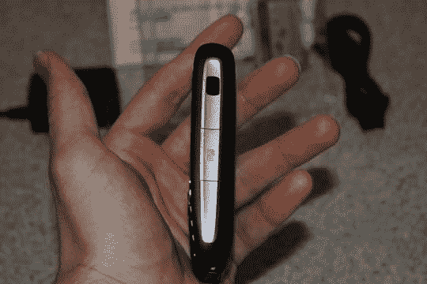

# 拆箱:Treo 750–TechCrunch

> 原文：<https://web.archive.org/web/http://techcrunch.com/2007/01/16/unboxed-treo-750/>

看一看我在 CES 上闲聊的成果之一:一台 [Palm Treo 750](https://web.archive.org/web/20210302024729/http://crunchgear.com/2007/01/07/cingular-debuts-treo-750-umts-windows-mobile-5/) 。今天早上，它通过一个长相可疑的联邦快递员(他不是我的普通快递员，很奇怪！).

我将在接下来的几天里进行全面的审查，但现在，请允许我用一些热辣的 Treo 750 色情片来吊你的胃口。所有角度都暴露在下面！

为了让你看得开心，包装里的东西展开了。

.</root>)

金钱出手。

按下一些按钮。

背面。

 IR 和 MiniSD。

和底部。