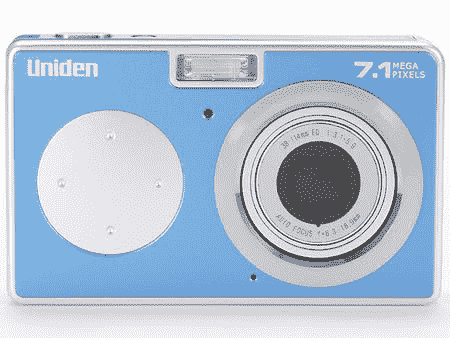

# Uniden UDC-7M 发布

> 原文：<https://web.archive.org/web/http://techcrunch.com/2006/09/12/uniden-udc-7m-announced/>

Uniden 刚刚发布了一款新的数码相机型号 UDC-7M。它有一个 7.1 百万像素的 CCD，3 倍的光学变焦，23MB 的板载存储，“人脸识别技术”(编辑:人脸识别？)而且没有取景器。当然，它的背面有一个 2.4 英寸的 LCD 屏幕，但偶尔，我还是会透过那个小窗口看看相机看到了什么。我是一个人吗？不过，对于较小的相机来说，缺少取景器是很常见的。

无论如何，它有三种颜色，你现在可以直接从 [Uniden 的日本网站](https://web.archive.org/web/20210123090620/http://www.uniden-direct.jp/store/product/dc7_01.html)订购，大约 212 美元，比这个联盟中的其他相机便宜一点。对于一个 710 万像素的相机来说，这还算不错。你还可以利用它的几个预设自动，运动，人像，防抖，花卉，夜间人像，烟花，灯，化妆品，黑白，深褐色，锐利，对比度和生动。可惜它只支持到 ISO800。

[Uniden UDC-7M 数码相机【Fareastgizmos.com via](https://web.archive.org/web/20210123090620/http://www.fareastgizmos.com/media_devices/uniden_udc7m_digital_camera.php)[Gizmodo](https://web.archive.org/web/20210123090620/http://www.gizmodo.com/gadgets/digital-cameras/uniden-udc7m-purdy-colors-no-optical-finder-200017.php)